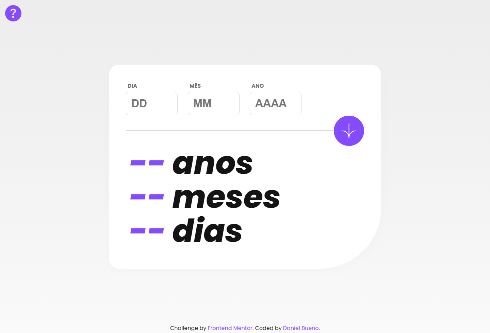
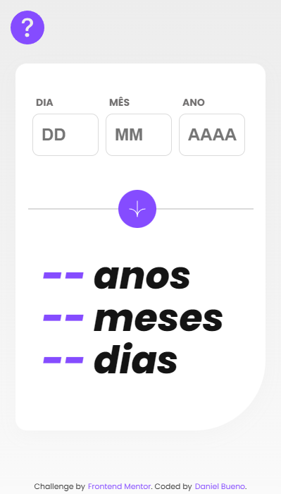

# Age Calculator App

#### O Age Calculator App calcula a sua idade de em anos, meses e dias, com base na sua data de nascimento. Um desafio do Frontend Mentor.

### 🔗 Links

### 💻📱 Screenshots

### 🛠 Funcionalidades

- Mostra sua idade em anos, meses e dias;
- Responsividade.

### 👾 Tecnologias

### ✅ Melhorias
- Um botão indicando a funcionalidade do site;
- Animações de entrada e transições;
- Melhor responsividade.

### 🎓 Aprendizados
- CSS: 
- Estilização de inputs;
- Melhor entendimento de Animations, Transitions e responsividade com @media.

- JS: 
- Tratamento e padronização de dados;
- Melhor entendimento do return;
- Math.ceil e Math.abs;
- Criação de datas.

### 📚 Referência

### 📱 Contato

danielsrbueno@gmail.com